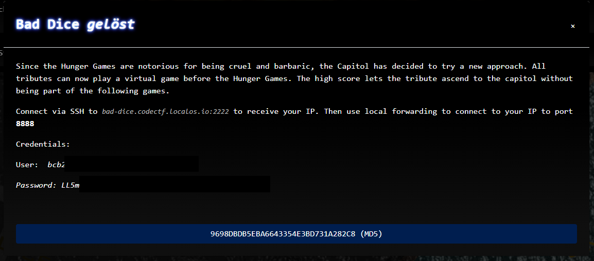
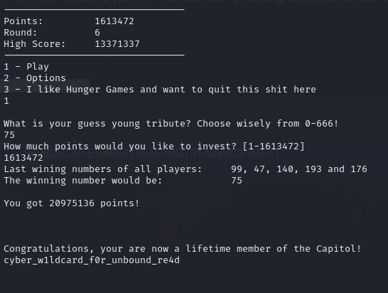

# CTF2022 - Spanning Tree Quali: Bad Dice

  
  
-lightgrey.svg)

## Description


## Attached files
- 9698dbdb5eba6643354e3bd731a282c8 (REDACTED)

## Flag
```
cyber_w1ldcard_f0r_unbound_re4d
```

## Detailed solution
This challenge was about a game where you had to guess a random number between 0 and 666 and then choose how many of your points you wanted to invest for your bet. You started out with 3 points.

This challenge was a bit flawed, as I was told by one of the admins after we "solved" it.

After every guess the winning number was printed out and it did not change after restarting the program.

So you could just write down every winning number, place the highest amount of points you had and start over, if you were wrong.

This lead to the following flag:

`