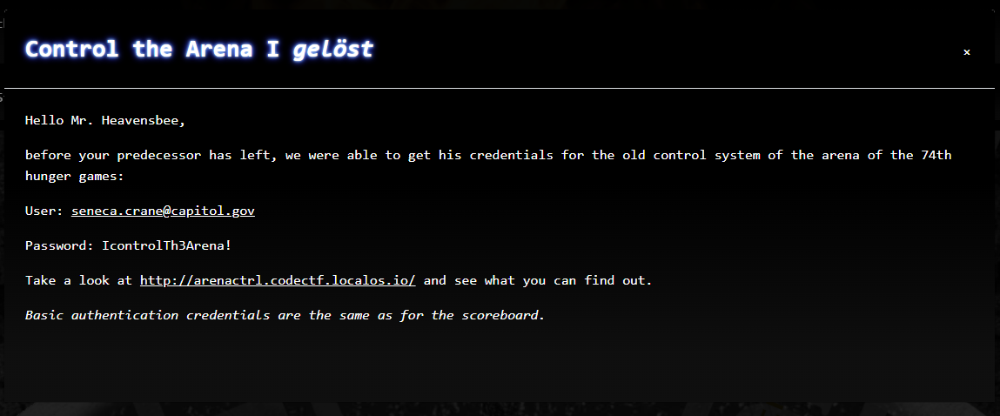

# CTF2022 - Spanning Tree Quali: Control the Arena

  
  


## Description


## Attached files
- 

## Flag
```
cyber_YouOwnTh3Arena!
```

## Detailed solution
This was the web challenge of this year.

After visiting the website and logging in, you were greeted with the message:

"You don't have the right permissions. Greetings from President Snow"

Firing up burp and inspecting all the requests it become clear pretty fast, that this challenge has to do with JWT tampering as there was a request to the "/admin" controller returning "401 Unauthorized" and the return of a JWT from the "/loggedin" controller.

Inspecting the token revelead the following structure:

```json
{
  "alg": "RS256",
  "typ": "JWT"
}
{
  "iss": "seneca.crane@capitol.gov",
  "sub": "63480a8c60fe61a9dbf00c40",
  "iat": 1665684188966,
  "exp": 1665770588966,
  "admin": false
}
{
    <SIGNATURE STUFF REDACTED>
}
```

Not hard to tell, that you have to alter the "admin" key to "true" and make the server accept the JWT.

We tried several different vectors:

- Testing, whether the server accepts unchecked tokens ("alg" -> "none") (CVE-2015-9235)
- Changing the algorithm RS256 (asymmetric) to HS256 (symmetric) (CVE-2016-5431/CVE-2016-10555)

But none of these worked.

With a little help from a friend we found out, that you could make the server use your own keys when you transmit them in the header (CVE-2018-0114).

So, we used burp with the extension "JWT Editor" to generate our own keys, put them in the header and sign the JWT with them:


