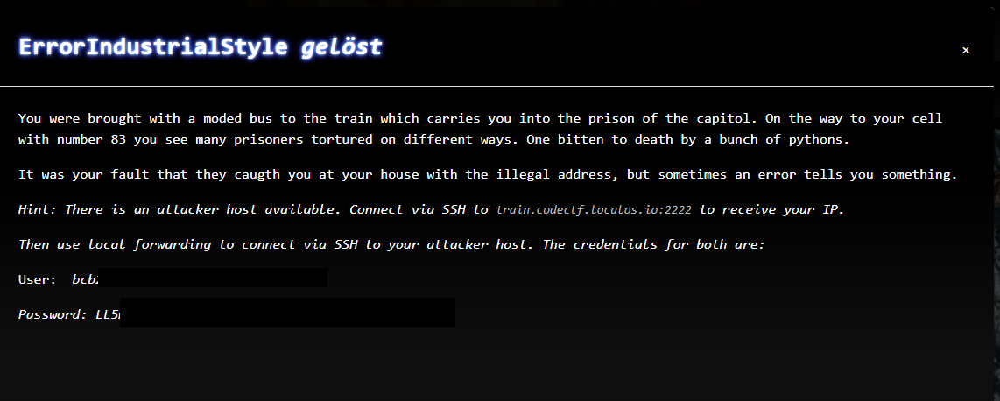
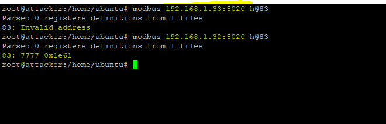
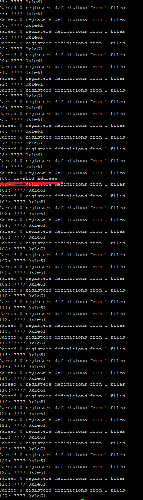

# CTF2022 - Spanning Tree Quali: ErrorIndustrialStyle

  
  


## Description


## Attached files
- 

## Flag
```
cyber_LucyGr4YTh3F1r5tS0ngb1rd
```

## Detailed solution
This challenge was very fun! The challenge text was very well chosen!

The "typo" in the first sentence ("moded bus") made clear that this challenge is about the "Modbus protocol".

So after connecting to our attacker machine the first thing after looking around in the file system was to install "nmap" to check out our "surroundings" (scanning for other hosts on our network).

There were many other attacker machines up (from the other teams, as the challenge text stated).

We scanned these hosts for open ports 502 (Modbus/TCP) and 802 (Modbus/TCP Security), but they were all filtered or closed.

After a little hint, we became aware that our machine had a second network interface (192.168.1.0/24), so we started to scan for open ports there, too.

The scan resulted in 30 hosts that were no attacker machines.

As we did not know where to go from here (we did not want to bother all of the 30 hosts), we chose one to do a full port scan with nmap and found out that port 5020 was also open. This is the "Modbus/TCP server" port. Interesting!

We installed a modbus tcp client (https://github.com/favalex/modbus-cli) and started to dig around in the registers of the 30 hosts.

There was nothing special at first, but we then remembered that the challenge text was about a number "83". Maybe the 83rd register is something that brings us forward? We kept on poking:



Huh? The host with IP "192.168.1.33" was behaving pretty strange. Every other host responded with the content of the register. We are on to something! Didn't the challenge name and text talk about an "error telling us something"?

With a little loop we asked another host for an error in a register: 

```bash
for m in {0..127};do modbus 192.168.1.40:5020 h@$m;done
```

and bingo! The error came up in another register!



We went through the whole 30 hosts and looked out for the faulty registers. This gave us a list of decimals.

Putting these decimals in an Dec2Text converter (in the right order: lowest IP to highest IP) resulted in the flag.
