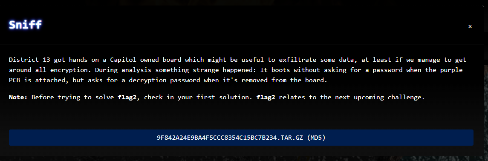

# CTF2022 - Spanning Tree Quali: Sniff

  
  


## Description


## Attached files
- 9f842a24e9ba4f5ccc8354c15bc7b234.tar.gz (REDACTED)
- out

## Flag
```
cyber_TpM_LpC_bUs_Sn1fFiNg
```

## Detailed solution
This was the forensics challenge of the qualification this year and it gave us a very bad headache!

Extracting the given archive resulted in the following files:

- a directory with three pictures in it ("apu2-board.jpg", "logic-analyzer-probes.jpg" and "tpm-chip.jpg")
- a file called "apu2-boot.sr"
- a file called "sdcard.img"


The images were showing a board from an APU2, a purple PCB (remember the challenge text!) and some probes connected to the PCB.

The task was clear soon, but we had no knowledge of "hardware hacking". 

After a bit of research we found out, that the "apu2-boot.sr" file contained all the captured signals from the probes and we can have a look at them with "PulseView" which is a GUI for a signal analysis software called "sigrok" (https://sigrok.org/wiki/Main_Page):


As the challenge text states the PCB must somehow contain a passphrase to decrypt the device on boot... So this password has to be somehow hidden in this mess of data.

After some further research we found the data sheet for the module that was shown on the picture with the name "tpm-chip.jpg". It is called "SLB9665TT20":

https://www.infineon.com/dgdl/Infineon-data-sheet-SLB9665_2.0_Rev1.2-DS-v01_02-EN.pdf?fileId=5546d462689a790c016929d1d3054feb

As it states in the data sheet the module has an interface for LPC (Low Pin Count) communication.

How lucky we are that sigrok has a decoder for LPC data! Well.... wrong thought... But more to that later on.

We added the decoder to the PulseView "scenario" and had to map the pin signals to the channels the LPC decoder offers... But how do we do that? We need more research...

After a long time we finally found the matching pin to channel mapping and we configured the decoder accordingly:


Nice, what a journey up to this point.... So, let the decoder do its work, right?

**WRONG!** As it turned out, the default LPC decoder does not have the correct implementation for TPM.... It was always throwing some "negative left shift" error while decoding.

Some more googling lead to the information that there are patches for this issue:

- https://github.com/sigrokproject/libsigrokdecode/pull/78
- https://www.mail-archive.com/sigrok-devel@lists.sourceforge.net/msg04267.html#

(Note how the second link leads to patches made by "rot42" in August this year.... What a coincidence)

Nonetheless we tried the other patch for the decoder first and.... failed. It would decode the signals but in a very strange way, splitting the TPM data off their address calls....

After reading a very interesting blog post about sniffing of TPM data (https://pulsesecurity.co.nz/articles/TPM-sniffing) we were sure to go the right way:

- Looking for reads on address "0x0024" and collect the corresponding data

But, like mentioned before, the "github-patch" made the readings very difficult and we only got some readable characters like "*a5ynBsniM*".

Asking for a little support, we were told that we are missing some characters and should try to use the patch from the mailing list.

After cleaning up the decoder-patch-mess we created on our systems, we could get the correct decoded data (which is in the attached out file).

Parsing it with the following snippet:

```bash
cat out | grep -A 6 TPM | grep -A 5 'Cycle type: I/O read' | grep -A 4 'Address: 0x0024'  | sed -rne 's/.DATA: 0x(.)/\1/p' > out_data
```

We got a whole bunch of hex bytes that we decoded with a Hex2Text converter and in some clutter, we found the readable string "*Ua5ynBsnxqpJi6MF*". This has to be it! But what exactly? It is not a VMK like in the blog linked above.

Time to inspect the "sdcard.img" file:

```bash
bsdtar xf sdcard.img
xzcat boot/initrd | cpio -i
```

This resulted into a file "crypt1.bin" next to some other linux os stuff...

Using the "file" command to get some more information of this thing, resulted in:

```bash
crypt1.bin: LUKS encrypted file, ver 2 [, , sha256] UUID: 58f3996e-71d5-4153-9226-55a518fced0c
```

LUKS file it is! Using the passphrase from the TPM dump we were able to decrypt that file:

```bash
cryptsetup luksOpen  crypt1.bin ctf
mkdir /media/ctf
mount /dev/mapper/ctf /media/ctf
```


There is the flag! And some stuff for another challenge, we were not able to complete. What a journey....
